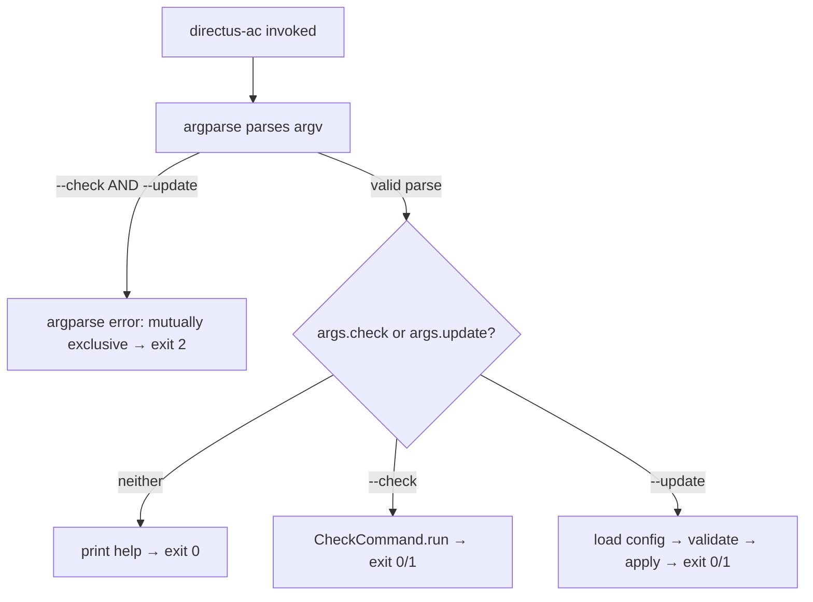

# Design Document

## Overview

This design refactors the `directus-ac` CLI so that neither `--check` nor `--update` is the default behavior. Currently, invoking `directus-ac` without `--check` runs the permission-apply pipeline implicitly. After this change, both modes require an explicit flag, and bare invocation prints help and exits cleanly.

The change is confined to `directus_ac/cli.py` (parser construction and `main()` orchestration) and `tests/test_cli.py`.

## Architecture

The CLI remains a single-module design with no subcommands. The key architectural change is introducing a **mutually exclusive argument group** in argparse that contains `--check` and `--update`. A post-parse guard detects when neither flag is set and prints help.



## Components and Interfaces

### `build_parser() → argparse.ArgumentParser`

Modified to:
1. Add a mutually exclusive group containing `--check` and `--update`.
2. Add `--update` as a `store_true` flag with help text describing the permission-apply pipeline.
3. Move `--check` into the mutually exclusive group (currently it's a standalone argument).
4. Update the parser description/epilog to indicate that one of `--check` or `--update` is required.

```python
def build_parser() -> argparse.ArgumentParser:
    parser = argparse.ArgumentParser(
        description="Manage Directus access control permissions declaratively.",
        epilog="One of --check or --update is required to perform an operation.",
    )

    # Common options
    parser.add_argument("--config", default="./directus_ac.yaml", ...)
    parser.add_argument("--url", default=None, ...)
    parser.add_argument("--token", default=None, ...)
    parser.add_argument("--create-roles", action="store_true", default=False, ...)

    # Mutually exclusive mode group
    mode = parser.add_mutually_exclusive_group()
    mode.add_argument("--check", action="store_true", default=False, ...)
    mode.add_argument("--update", action="store_true", default=False, ...)

    return parser
```

### `main() → None`

Modified to:
1. After parsing, check if neither `args.check` nor `args.update` is set → call `parser.print_help()` then `sys.exit(0)`.
2. Route `--update` to the existing permission-apply pipeline (previously the default path).
3. Route `--check` to `CheckCommand.run()` (unchanged).

```python
def main() -> None:
    parser = build_parser()
    args = parser.parse_args()

    if not args.check and not args.update:
        parser.print_help()
        sys.exit(0)

    # ... logging setup, credential resolution, mode dispatch ...
```

### Behavioral Notes

- **`--create-roles` with `--check`**: The flag is accepted (no parse error) but silently ignored — the check path never references `args.create_roles`.
- **Mutual exclusivity exit code**: argparse's `add_mutually_exclusive_group()` raises a parse error with exit code 2 when both flags are provided. No custom handling needed.
- **Existing `--check` behavior**: Unchanged. The only difference is that `--check` now lives inside the exclusive group.

## Data Models

No new data models are introduced. The change operates entirely on `argparse.Namespace` attributes:

| Attribute | Type | Source |
|-----------|------|--------|
| `args.check` | `bool` | `--check` flag (default `False`) |
| `args.update` | `bool` | `--update` flag (default `False`) |
| `args.config` | `str` | `--config` option (default `"./directus_ac.yaml"`) |
| `args.url` | `str | None` | `--url` option |
| `args.token` | `str | None` | `--token` option |
| `args.create_roles` | `bool` | `--create-roles` flag (default `False`) |

## Error Handling

| Scenario | Output | Exit Code | Mechanism |
|----------|--------|-----------|-----------|
| No flags provided | Help text to stdout | 0 | Manual check + `parser.print_help()` |
| `--check` and `--update` together | argparse error to stderr | 2 | `add_mutually_exclusive_group()` |
| Missing URL/token | Error message to stderr | 1 | Existing credential resolution logic |
| Pipeline runtime error | Error message to stderr | 1 | `DirectusACError` catch block |
| Successful check or update | Summary to stdout | 0 | Existing success paths |

## Testing Strategy

### Why Property-Based Testing Does Not Apply

This feature is a CLI argument parsing refactor. The input space is a small, finite set of flag combinations (not a large or infinite domain). Behavior is deterministic and fully covered by enumerating the relevant flag combinations. There are no pure functions with wide input variation, no serialization, no data transformations — just conditional branching on boolean flags. Example-based unit tests provide complete coverage with less complexity.

### Test Plan

All tests use **pytest** with `monkeypatch` for `sys.argv` and environment variables, and `unittest.mock.patch` for isolating side effects.

#### No-Flag Behavior (Requirement 1)

| Test | Assertion |
|------|-----------|
| Bare invocation (`directus-ac`) | Exits 0, stdout contains `--check` and `--update` descriptions |
| Common options only (`--config x.yaml`) | Exits 0, stdout contains help text |

#### Update Flag (Requirement 2)

| Test | Assertion |
|------|-----------|
| `--update` with valid credentials | Pipeline executes, exits 0, summary printed |
| `--update` with pipeline error | Exits 1, error on stderr |
| `--update` accepts `--create-roles` | `args.create_roles` is `True`, pipeline uses it |

#### Check Flag Continuity (Requirement 3)

Existing `TestCheckFlagParsing` and `TestCredentialResolutionCheckMode` tests remain valid. No changes needed.

#### Mutual Exclusivity (Requirement 4)

| Test | Assertion |
|------|-----------|
| `--check --update` | Exits 2, stderr contains "not allowed" |

#### Create-Roles Relevance (Requirement 5)

| Test | Assertion |
|------|-----------|
| `--check --create-roles` | Check runs normally, `--create-roles` ignored |
| `--update --create-roles` | Pipeline creates missing roles |

#### Help Text Content (Requirement 6)

| Test | Assertion |
|------|-----------|
| Help output | Contains `--update`, `--check`, `--config`, `--url`, `--token`, `--create-roles` descriptions |
| Help output | Contains epilog indicating one mode is required |

#### Exit Codes (Requirement 7)

Covered implicitly by the tests above. Each test asserts the expected exit code.
