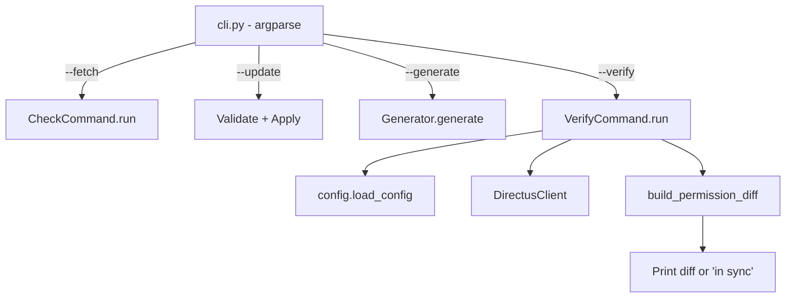

# Design Document: CLI Refactor & Verify

## Overview

This feature refactors the `directus-ac` CLI by renaming two options (`--check` → `--fetch`, `--config` → `--permission-file`) and introducing a new `--verify` command that compares the local permission file against a live Directus instance to detect drift. The README is updated to reflect the new interface.

The changes are localised to:
- `directus_ac/cli.py` — argument parser definition and dispatch logic
- A new `directus_ac/verify.py` — the verification/comparison engine
- `README.md` — updated usage documentation

The existing `CheckCommand`, `Generator`, config loading, and permission management modules remain unchanged in logic; only the references from the CLI layer are updated.

## Architecture



The `--verify` path introduces a new `VerifyCommand` class that:
1. Loads the permission file via `load_config()`
2. Fetches live state (permissions, policies, roles, collections) from the Directus instance
3. Builds a normalised representation of both local and remote permission sets
4. Computes the diff and outputs results

## Components and Interfaces

### CLI Argument Changes (`cli.py`)

**Renamed options:**
- `--check` → `--fetch` (flag, `store_true`)
- `--config` → `--permission-file` (string, default `./directus_ac.yaml`)

**New option:**
- `--verify` (flag, `store_true`) — added to the mutually exclusive mode group alongside `--fetch`, `--update`, `--generate`

**Internal attribute access:**
- `args.check` → `args.fetch`
- `args.config` → `args.permission_file`

### VerifyCommand (`verify.py`)

```python
class VerifyCommand:
    def __init__(self, client: DirectusClient, config: DirectusACConfig) -> None: ...
    def run(self) -> PermissionDiff: ...
```

**Responsibilities:**
- Fetch all permissions, policies, roles from the Directus instance
- Resolve the policy→role chain to build a set of `(role_name, collection, action)` triples representing live state
- Parse the local config into the same triple representation, including custom permissions
- Compare the two sets and produce a `PermissionDiff`

### PermissionDiff Model

```python
@dataclass
class PermissionDiffEntry:
    role: str
    collection: str
    action: str
    diff_type: Literal["missing_remote", "missing_local", "action_mismatch"]
    detail: str | None = None  # e.g. field/validation difference for custom perms

@dataclass
class PermissionDiff:
    in_sync: bool
    entries: list[PermissionDiffEntry]
```

The diff categorises differences into:
- **missing_remote**: Permission exists in the file but not on the instance
- **missing_local**: Permission exists on the instance but not in the file
- **action_mismatch**: Permission exists in both but differs (custom permission fields, validation, or item-level permissions)

### Diff Computation Logic

1. **Build local permission set**: Expand groups into `(role, collection, action)` triples. For custom permissions, include the associated metadata (fields, validation, permissions).
2. **Build remote permission set**: Fetch all permissions from Directus, resolve policy→role mapping, and build the same triple structure. For permissions with non-default constraints (fields ≠ `["*"]`, validation ≠ None, item permissions ≠ None), include metadata.
3. **Compare**:
   - Triples in local but not remote → `missing_remote`
   - Triples in remote but not local → `missing_local`
   - Triples in both but with differing metadata → `action_mismatch`

### Output Format

**In sync:**
```
Permissions are in sync.
```

**Differences found:**
```
Permission differences found:

Missing from Directus instance:
  editor / articles / delete

Missing from permission file:
  viewer / comments / update

Custom permission differences:
  editor / articles / update: fields differ (local: [title, body], remote: [title])
```

## Data Models

### Existing Models (unchanged)

- `DirectusACConfig` — top-level config with collections, roles, groups, custom_permissions
- `GroupDefinition` — maps collections to per-role permission keywords + custom refs
- `CustomPermissionEntry` — a permission with validation/fields/permissions constraints
- `DirectusPermission` — API response model for a single permission entry
- `DirectusPolicy`, `DirectusRole`, `DirectusCollection` — API response models

### New Models (`verify.py`)

```python
from dataclasses import dataclass, field
from typing import Literal

@dataclass
class PermissionTriple:
    """Normalised representation of a single permission assignment."""
    role: str
    collection: str
    action: str  # "read", "create", "update", "delete"
    fields: list[str] | None = None
    validation: dict | None = None
    permissions: dict | None = None  # item-level

@dataclass
class PermissionDiffEntry:
    """A single difference between local and remote permission state."""
    role: str
    collection: str
    action: str
    diff_type: Literal["missing_remote", "missing_local", "action_mismatch"]
    detail: str | None = None

@dataclass
class PermissionDiff:
    """Result of comparing local permission file against live Directus state."""
    in_sync: bool
    entries: list[PermissionDiffEntry] = field(default_factory=list)
```

### Normalisation Functions

```python
def build_local_triples(config: DirectusACConfig) -> list[PermissionTriple]:
    """Expand a DirectusACConfig into a flat list of PermissionTriples."""
    ...

def build_remote_triples(
    permissions: list[DirectusPermission],
    policies: list[DirectusPolicy],
    roles: list[DirectusRole],
) -> list[PermissionTriple]:
    """Resolve Directus API state into a flat list of PermissionTriples."""
    ...

def compute_diff(
    local: list[PermissionTriple],
    remote: list[PermissionTriple],
) -> PermissionDiff:
    """Compare local and remote triple sets, return structured diff."""
    ...
```


## Correctness Properties

*A property is a characteristic or behavior that should hold true across all valid executions of a system — essentially, a formal statement about what the system should do. Properties serve as the bridge between human-readable specifications and machine-verifiable correctness guarantees.*

### Property 1: Mutual exclusion of mode flags

*For any* combination of two or more mode flags from the set {`--fetch`, `--update`, `--generate`, `--verify`}, the argument parser SHALL reject the input with an error.

**Validates: Requirements 1.4, 3.2**

### Property 2: Identical permissions produce in-sync result

*For any* valid `DirectusACConfig`, if the remote permission state is constructed to be semantically identical to the local config (same role-collection-action triples with same metadata), then `compute_diff` SHALL return a `PermissionDiff` with `in_sync=True` and an empty entries list.

**Validates: Requirements 3.5**

### Property 3: Set difference completeness

*For any* two sets of `PermissionTriple` values (local and remote), every triple that exists in local but not in remote SHALL appear in the diff as `missing_remote`, and every triple that exists in remote but not in local SHALL appear in the diff as `missing_local`. Furthermore, if the two sets are not identical, `in_sync` SHALL be `False`.

**Validates: Requirements 3.6, 3.7, 3.8**

### Property 4: Metadata mismatch detection

*For any* `PermissionTriple` that exists in both local and remote (same role, collection, action) but with different metadata (fields, validation, or item-level permissions), it SHALL appear in the diff as an `action_mismatch` entry.

**Validates: Requirements 3.9, 3.10**

## Error Handling

| Condition | Behavior | Exit Code |
|---|---|---|
| Permission file not found | Print `Error: Config file not found: <path>` to stderr | 1 |
| Permission file has invalid YAML | Print YAML parse error with line/column | 1 |
| Directus instance unreachable | Print connection error message | 1 |
| Auth token invalid/missing | Print auth error | 1 |
| No mode flag provided | Print help text to stdout | 0 |
| Conflicting mode flags | argparse prints usage error | 2 (argparse default) |
| Verify finds differences | Print diff to stdout | 1 |
| Verify finds no differences | Print "Permissions are in sync." | 0 |

Error handling for the `--verify` path reuses the existing `DirectusACError` exception hierarchy. The `VerifyCommand` does not introduce new exception types — it catches `ConfigError` (from `load_config`) and connection errors (from `DirectusClient`) and lets them propagate to the CLI's top-level handler.

## Testing Strategy

### Property-Based Tests (Hypothesis)

The project already uses Hypothesis for PBT. The following property tests will be added:

| Property | Test File | Iterations |
|---|---|---|
| 1: Mutual exclusion | `tests/test_cli_mutual_exclusion_property.py` | 100 |
| 2: Identical → in-sync | `tests/test_verify_insync_property.py` | 100 |
| 3: Set difference completeness | `tests/test_verify_diff_completeness_property.py` | 100 |
| 4: Metadata mismatch | `tests/test_verify_metadata_mismatch_property.py` | 100 |

**Configuration:**
- Library: `hypothesis` (already a project dependency)
- Each test tagged with: `Feature: cli-refactor-verify, Property {N}: {title}`
- Minimum 100 examples per property (`@settings(max_examples=100)`)

### Unit Tests (pytest)

Example-based tests covering:
- Parser accepts `--fetch`, rejects `--check`
- Parser accepts `--permission-file`, rejects `--config`
- Default value for `--permission-file` is `./directus_ac.yaml`
- `--fetch` dispatches to `CheckCommand.run()`
- `--verify` dispatches to `VerifyCommand.run()`
- Exit code 0 when in-sync, exit code 1 when differences found
- Help text includes new option names
- No mode flag → help printed, exit 0

### Edge Case Tests

- Permission file does not exist → error + exit 1
- Directus instance unreachable → error + exit 1
- Empty config (no groups) compared against empty remote → in-sync
- Config with custom permissions compared against remote with different validation → action_mismatch

### Integration / Smoke Tests

- `--verify` end-to-end with mocked HTTP (using `respx` or `httpx` mock transport)
- README contains `--fetch`, `--permission-file`, `--verify`; does not contain `--check`, `--config`
