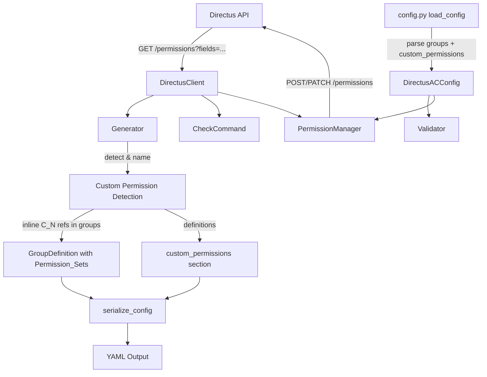

# Design Document: Custom Permissions

## Overview

This feature extends the directus-ac CLI tool to support "custom permissions" — Directus permission entries that carry additional constraints (validation rules, field-level restrictions, item-level permissions) beyond basic CRUD actions. Currently, the tool collapses all permissions into a single `Permission_Set` per role+collection, losing these richer entries.

The design introduces:
1. Detection logic in the Generator to distinguish custom from standard permissions
2. A simple naming scheme (`C_1`, `C_2`, `C_3`, ...) using a global counter
3. Inline references to custom permissions within the groups' `Permission_Set` strings (e.g., `READ WRITE C_1`)
4. A `custom_permissions` top-level YAML section serving as a definitions/lookup section for the inline references
5. Extended API fetching to retrieve `fields`, `validation`, and `permissions` attributes
6. Integration with `--check`, `--update`, and `--generate` commands

Key design changes from the previous iteration:
- **Simplified naming**: No more policy/collection sanitization. Names are simply `C_1`, `C_2`, `C_3`.
- **Inline in groups**: Custom permission references appear directly in the groups' Permission_Set strings alongside standard keywords (READ, WRITE, etc.), rather than being a separate concern.
- **Check command inline display**: Custom permissions appear inline in the policies section output (e.g., `collection: read, create, C_1`) rather than in a separate "Custom Permissions" section.

## Architecture

The feature touches all major modules in the existing pipeline:



Key architectural decisions:
- **Detection is attribute-based**: A permission is "custom" if it has non-null `validation`, non-default `fields`, or non-null `permissions` (item-level). This is also triggered when duplicate policy+collection+action entries exist.
- **Naming is trivial**: `C_1`, `C_2`, `C_3` — a global counter sorted by Directus permission `id` ascending. No sanitization logic needed.
- **Inline references**: Custom permissions are referenced by their `C_N` name directly in the groups' Permission_Set strings. The `custom_permissions` section serves as a definitions/lookup table that provides the full details for each reference.
- **Permission_Set is now mixed**: A Permission_Set string can contain both standard keywords (READ, WRITE, UPDATE, DELETE) and custom permission references (C_1, C_2). The config loader must handle both token types.

## Components and Interfaces

### 1. DirectusPermission Model (models.py)

Extended with optional attributes (already implemented):

```python
class DirectusPermission(BaseModel):
    id: int
    policy: str
    collection: str
    action: str
    fields: list[str] | None = None
    validation: dict | None = None
    permissions: dict | None = None  # item-level permissions
```

### 2. CustomPermissionEntry Model (models.py)

Model for config-level custom permission definitions:

```python
class CustomPermissionEntry(BaseModel):
    name: str  # Generated Permission_Name (C_1, C_2, etc.)
    policy: str  # Policy name (human-readable)
    collection: str
    action: str  # "create", "read", "update", "delete"
    validation: dict | None = None
    fields: list[str] | None = None
    permissions: dict | None = None  # item-level
```

### 3. DirectusACConfig Model (models.py)

Extended with optional custom_permissions field:

```python
class DirectusACConfig(BaseModel):
    collections: list[str]
    roles: list[str]
    groups: list[GroupDefinition]
    custom_permissions: list[CustomPermissionEntry] = []
```

### 4. GroupDefinition Model Update (models.py)

The `permissions` field type changes to support mixed Permission_Set strings containing both keywords and custom permission references:

```python
class GroupDefinition(BaseModel):
    collections: list[str]
    permissions: dict[str, list[PermissionKeyword | str]]
    # Values can now be PermissionKeyword enums OR string references like "C_1"
```

Alternatively, the Permission_Set can remain as `list[PermissionKeyword]` for standard keywords, with custom references stored separately or the type broadened. The simplest approach: store the Permission_Set as a raw string in serialization and parse tokens that match `C_\d+` as custom references.

**Design decision**: Keep `GroupDefinition.permissions` as `dict[str, list[PermissionKeyword]]` for the in-memory model, and add a separate field `custom_permission_refs: dict[str, list[str]]` to track which custom permission names are associated with each role. This avoids breaking the existing type system while supporting inline serialization.

```python
class GroupDefinition(BaseModel):
    collections: list[str]
    permissions: dict[str, list[PermissionKeyword]]
    custom_permission_refs: dict[str, list[str]] = {}  # role -> [C_1, C_2, ...]
```

### 5. Custom Permission Detection (generate.py)

Existing method on `Generator` (already implemented):

```python
def _is_custom_permission(self, perm: DirectusPermission) -> bool:
    """Return True if the permission has non-default constraints."""
    if perm.validation is not None:
        return True
    if perm.fields is not None and perm.fields != ["*"]:
        return True
    if perm.permissions is not None:
        return True
    return False
```

Duplicate detection (same policy+collection+action appearing multiple times) marks ALL entries in that combination as custom.

### 6. Permission Name Generation (generate.py)

Simplified function:

```python
def generate_permission_name(counter: int) -> str:
    """Generate a Permission_Name: C_{COUNTER}.
    
    Counter is a global sequence across all custom permissions, assigned by
    ascending Directus permission id.
    """
    return f"C_{counter}"
```

No sanitization of policy or collection names is needed — the name is purely counter-based.

### 7. Generator: Inline References in Groups (generate.py)

The `Generator.generate()` method is updated to:
1. Detect custom permissions as before
2. Assign `C_N` names using the global counter
3. For each custom permission, determine which role+collection group it belongs to (via policy→role resolution)
4. Add the `C_N` reference to that group's Permission_Set for the corresponding role
5. Build the `custom_permissions` definitions list

This means a group's Permission_Set in the serialized YAML looks like:
```yaml
permissions:
  role1_ro: READ C_1
  role2_rw: READ WRITE C_2
```

### 8. Config Loader Extension (config.py)

The `_parse_permission_set` function is updated to accept both standard keywords (READ, WRITE, UPDATE, DELETE) and custom permission references (tokens matching `C_\d+`). Custom references are stored separately from keywords.

New function `_parse_custom_permissions(raw: Any) -> list[CustomPermissionEntry]` that:
- Validates the `custom_permissions` key is a list (or absent)
- Validates each entry has required fields: `name`, `policy`, `collection`, `action`
- Validates `action` is one of `create`, `read`, `update`, `delete`
- Returns parsed `CustomPermissionEntry` list

### 9. Serializer Extension (generate.py)

`serialize_config` extended to:
- Include custom permission references inline in the Permission_Set strings (e.g., `"READ WRITE C_1"`)
- Output `custom_permissions` definitions section after `groups` when non-empty

### 10. CheckCommand Extension (check.py)

The `_format_policies` method is updated to show custom permissions inline:
- Instead of a separate "Custom Permissions" section, custom permission references appear in the policies section alongside standard actions
- Format: `collection: read, create, C_1, C_2`
- Indicators are appended to each reference: `C_1 fields:(title,body)`, `C_1 has validation`, `C_1 has item permissions`

### 11. PermissionManager Extension (permissions.py)

Existing method `apply_custom_permissions(custom_perms, policy_name_to_id)` that:
- Resolves policy names to IDs
- Matches existing custom permissions for update vs create
- Applies via POST/PATCH with full payload (validation, fields, permissions)

### 12. Validator Extension (validator.py)

Existing method `validate_custom_permissions(custom_perms, config_collections)` that:
- Checks policy names are resolvable
- Checks collections are in the config's collections list

## Data Models

### CustomPermissionEntry

| Field | Type | Required | Description |
|-------|------|----------|-------------|
| name | str (C_N pattern) | Yes | Generated permission name (e.g., C_1, C_2) |
| policy | str (1-255 chars) | Yes | Human-readable policy name |
| collection | str (1-255 chars) | Yes | Collection name |
| action | str | Yes | One of: create, read, update, delete |
| validation | dict \| None | No | Directus validation rules |
| fields | list[str] \| None | No | Restricted field list |
| permissions | dict \| None | No | Item-level permission rules |

### YAML Config Structure

```yaml
collections:
  - articles
  - comments
roles:
  - editor
  - viewer
groups:
  - collections:
      - articles
    permissions:
      editor: READ WRITE UPDATE DELETE C_1 C_2
      viewer: READ
custom_permissions:
  - name: C_1
    policy: editor — directus-ac
    collection: articles
    action: update
    validation:
      _and:
        - status:
            _eq: draft
    fields:
      - title
      - body
  - name: C_2
    policy: editor — directus-ac
    collection: articles
    action: read
    permissions:
      _and:
        - author:
            _eq: $CURRENT_USER
```

### Permission Name Generation

```
Input: counter=3
Output: "C_3"
```

No sanitization, no policy/collection components. The `custom_permissions` definitions section already contains the policy and collection context for each entry.

**Counter assignment**: The counter is a single global sequence across ALL custom permissions. Permissions are sorted by Directus `id` ascending, then assigned counter 1, 2, 3, ... in that order. This guarantees uniqueness and determinism across runs.

### Permission_Set Parsing

A Permission_Set string can now contain two types of tokens:
1. **Standard keywords**: `READ`, `WRITE`, `UPDATE`, `DELETE` (case-insensitive)
2. **Custom permission references**: Tokens matching the pattern `C_\d+` (e.g., `C_1`, `C_2`)

Example: `"READ WRITE C_1 C_2"` → keywords=[READ, WRITE], custom_refs=["C_1", "C_2"]

### Check Command Output Format

```
Policies
  EditorRole
    editor — directus-ac
      articles: read, create, update, delete, C_1 fields:(title,body), C_2 has validation
      comments: read, create
  ViewerRole
    viewer — directus-ac
      articles: read
```

Custom permissions appear inline in the comma-separated action list. Indicators are appended directly to the reference token.

### DirectusClient API Request

```
GET /permissions?limit=-1&fields=id,policy,collection,action,fields,validation,permissions
```

## Correctness Properties

*A property is a characteristic or behavior that should hold true across all valid executions of a system — essentially, a formal statement about what the system should do. Properties serve as the bridge between human-readable specifications and machine-verifiable correctness guarantees.*

### Property 1: Custom permission detection correctness

*For any* DirectusPermission entry, the detection function SHALL classify it as custom if and only if it has a non-null `validation`, a `fields` value that is non-null and not equal to `["*"]`, a non-null `permissions` attribute, OR it shares a (policy, collection, action) triple with at least one other permission entry in the input set.

**Validates: Requirements 1.1, 1.2**

### Property 2: Inline reference correctness

*For any* Directus state containing custom permissions, the generated config's groups SHALL contain `C_N` references in the Permission_Set strings for the corresponding role+collection, and every `C_N` reference in a Permission_Set SHALL have a corresponding entry with that name in the `custom_permissions` definitions section.

**Validates: Requirements 1.3, 1.4, 2.4**

### Property 3: Counter assignment determinism and uniqueness

*For any* set of custom permissions, the counter values SHALL be assigned as a single global sequence starting at 1, where all custom permissions are sorted by their Directus permission `id` (ascending) and assigned consecutive counter values, resulting in all generated Permission_Name values being distinct.

**Validates: Requirements 2.2, 2.3**

### Property 4: Config parsing round-trip

*For any* valid `DirectusACConfig` containing custom permissions with inline references in groups, serializing it to YAML and parsing it back with `load_config` SHALL produce an equivalent config (same custom_permissions entries with same field values, same Permission_Set contents including custom references).

**Validates: Requirements 3.1, 3.2**

### Property 5: Invalid custom permission entry detection

*For any* custom permission entry that is missing a required field (`name`, `policy`, `collection`, or `action`) or has an action value not in {create, read, update, delete}, the config loader SHALL raise a `ConfigError` whose message identifies the specific problem and the entry index.

**Validates: Requirements 3.4, 3.6, 8.3**

### Property 6: Serialization correctness

*For any* `DirectusACConfig`, the serialized YAML SHALL: include `custom_permissions` key if and only if custom permissions exist; maintain key order `collections`, `roles`, `groups`, `custom_permissions`; include custom permission references inline in Permission_Set strings; and each custom permission entry SHALL contain name, policy, collection, action, and only non-null/non-empty optional attributes.

**Validates: Requirements 4.2, 4.3, 4.4**

### Property 7: Check command inline display with indicators

*For any* Directus state with custom permissions, the CheckCommand policies section output SHALL show custom permission references (C_N) inline alongside standard actions in a comma-separated list per collection, with "fields:(...)" appended when fields is non-null, and "has validation"/"has item permissions" indicators when those attributes are non-null.

**Validates: Requirements 5.1, 5.2, 5.3, 5.4**

### Property 8: Update command create/update correctness

*For any* set of custom permission config entries and existing Directus permission state, the PermissionManager SHALL create entries that don't exist (POST) and update entries that match by policy_id + collection + action with non-null constraints (PATCH), and the returned counts SHALL equal the number of POST and PATCH operations performed respectively.

**Validates: Requirements 6.1, 6.2, 6.4**

### Property 9: Validation batch error collection

*For any* set of custom permission entries where some reference unresolvable policy names or unknown collections, the Validator SHALL collect ALL invalid references before raising a single ValidationError that lists every unresolvable policy name and every unknown collection.

**Validates: Requirements 8.1, 8.2**

## Error Handling

| Scenario | Exception | Message Format |
|----------|-----------|----------------|
| `custom_permissions` is not a list | `ConfigError` | "custom_permissions must be a list" |
| Entry missing required field | `ConfigError` | "Custom permission at index {idx} is missing required field: {field}" |
| Invalid action value | `ConfigError` | "Custom permission at index {idx} has invalid action '{value}'. Must be one of: create, read, update, delete" |
| Invalid token in Permission_Set | `ConfigError` | "Invalid permission keyword '{token}' for role '{role}' on collection '{col}'" |
| Unresolvable policy name (validation) | `ValidationError` | "Custom permissions reference unknown policies:\n  - {name1}\n  - {name2}" |
| Unknown collection (validation) | `ValidationError` | "Custom permissions reference unknown collections:\n  - {col1}\n  - {col2}" |
| Unresolvable policy during update | `APIError` | "Cannot resolve policy '{policy_name}' for custom permission '{perm_name}'" |
| API error during apply | `APIError` | "Failed to apply custom permission '{perm_name}' (collection '{col}', action '{action}'): {detail}" |
| Unresolvable policy during generate | Skipped silently | Permission entry excluded from output |

Error handling follows existing patterns:
- Config-level errors are raised during `load_config()` before any API calls
- Validation errors are raised during `validate_custom_permissions()` after fetching API state
- API errors during `apply_custom_permissions()` are raised immediately on first failure (matching existing `apply_permissions` behavior)
- Generation gracefully skips unresolvable entries (matching existing orphan-exclusion behavior)

## Testing Strategy

### Property-Based Tests (Hypothesis)

The project already uses Hypothesis for property-based testing. Each correctness property maps to one or more property-based tests:

- **Property 1**: Generate random `DirectusPermission` objects with varying attribute combinations and duplicate triples; verify detection logic classifies correctly
- **Property 2**: Generate mixed Directus states; verify groups contain correct inline C_N references and all references have matching definitions
- **Property 3**: Generate permission sets with various IDs; verify counter assignment is sequential by ascending ID and all names are unique
- **Property 4**: Generate valid configs with custom permissions and inline references; verify serialize→parse round-trip preserves all data
- **Property 5**: Generate entries with missing/invalid fields; verify correct ConfigError with problem identification
- **Property 6**: Generate configs with/without custom permissions; verify YAML key order, section presence/absence, and content correctness
- **Property 7**: Generate custom permissions with various attributes; verify inline formatted output in policies section with correct indicators
- **Property 8**: Generate custom permission entries + existing state; verify create/update counts match operations
- **Property 9**: Generate entries with invalid references; verify all errors collected in single ValidationError

**Configuration**: Minimum 100 iterations per property test. Tag format: `Feature: custom-permissions, Property {N}: {title}`.

**PBT Library**: Hypothesis (already in `requirements-dev.txt`)

### Unit Tests (pytest)

Example-based tests for specific scenarios:
- Config without `custom_permissions` key parses successfully (Req 3.3)
- CheckCommand omits custom references when no custom permissions exist (Req 5.5)
- API error during apply includes Permission_Name in message (Req 6.3)
- Unresolvable policy during update raises correct APIError (Req 6.5)
- DirectusClient includes correct `fields` query parameter (Req 7.1)
- DirectusPermission model defaults optional fields to None (Req 7.2, 7.3, 7.4)
- DirectusClient populates extended attributes from response (Req 7.5)
- `generate_permission_name(1)` returns `"C_1"` (Req 2.1)
- Permission_Set with mixed tokens parses correctly: `"READ C_1 WRITE"` → keywords=[READ, WRITE], refs=[C_1]
- Unresolvable policy during generate is skipped silently (Req 4.5)

### Integration Tests

- End-to-end `--generate` with mocked Directus API containing custom permissions → verify inline references in groups and definitions section
- End-to-end `--update` with mocked API verifying correct POST/PATCH calls for custom permissions
- End-to-end `--check` output format with custom permissions displayed inline in policies section
