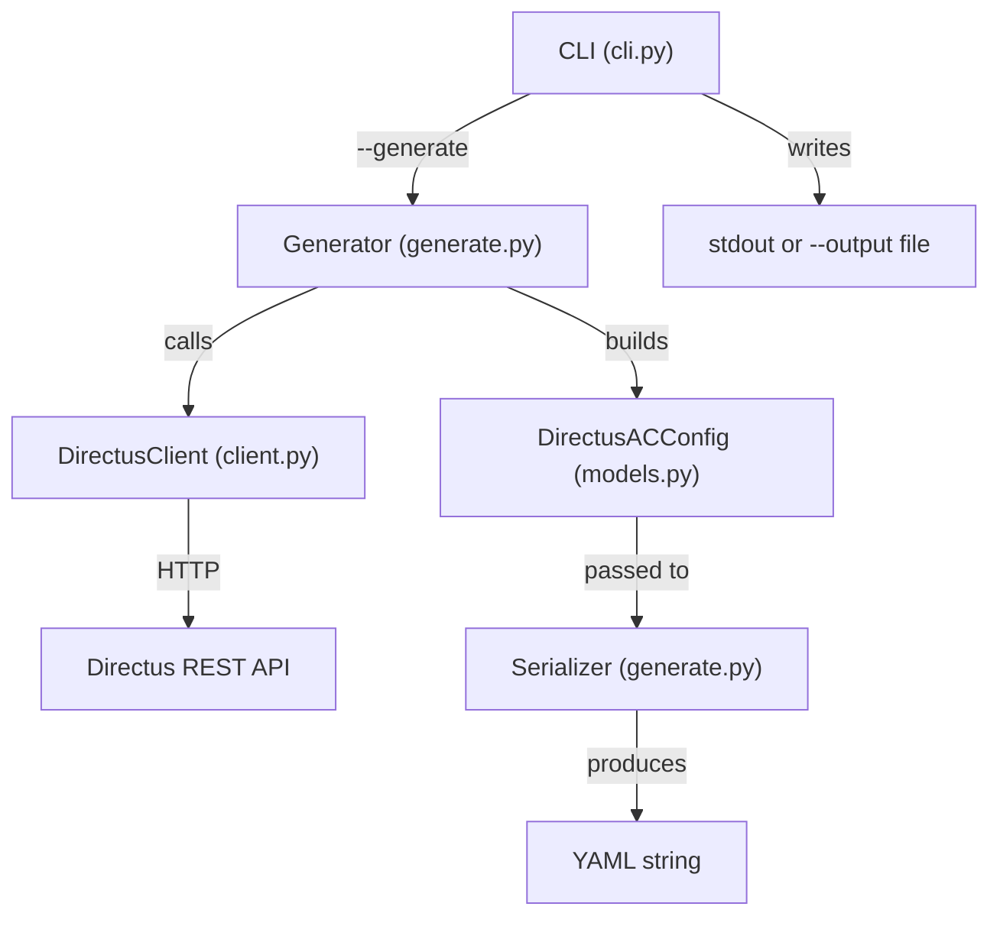

# Design Document: directus-ac-generate

## Overview

This feature adds a `--generate` flag to the `directus_ac` CLI that reads the current access control state from a running Directus instance and produces a `directus_ac.yaml` configuration file. It is the inverse of `--update`: where `--update` pushes config into Directus, `--generate` pulls state out.

The implementation introduces two new components:
- **Generator** — fetches collections, roles, and permissions from the Directus API via the existing `DirectusClient`, applies filtering, and builds a `DirectusACConfig` model object.
- **Serializer** — converts a `DirectusACConfig` into a YAML string with the formatting conventions expected by `load_config` (Permission_Set as space-separated strings, keys in canonical order).

The CLI is extended with `--generate` in the existing mutually exclusive group, plus `--output` and `--include-system` options.

## Architecture



Data flow:
1. CLI parses `--generate`, resolves `--url`/`--token`, instantiates `DirectusClient`.
2. `Generator` calls `client.get_collections()`, `client.get_roles()`, `client.get_permissions()`.
3. `Generator` filters collections (excludes `directus_*` unless `--include-system`).
4. `Generator` builds a role-ID-to-name map, discards permissions referencing unknown role IDs.
5. `Generator` groups permissions by collection, maps actions to keywords, assembles `DirectusACConfig`.
6. `Serializer` converts the config to YAML with proper formatting.
7. CLI writes the YAML to `--output` file or stdout.

## Components and Interfaces

### Module: `directus_ac/generate.py`

#### `REVERSE_ACTION_MAP`

```python
REVERSE_ACTION_MAP: dict[str, PermissionKeyword] = {
    "read": PermissionKeyword.READ,
    "create": PermissionKeyword.WRITE,
    "update": PermissionKeyword.UPDATE,
    "delete": PermissionKeyword.DELETE,
}
```

Maps Directus API action strings back to `PermissionKeyword` enum values.

#### Class: `Generator`

```python
class Generator:
    def __init__(self, client: DirectusClient, include_system: bool = False) -> None:
        ...

    def generate(self) -> DirectusACConfig:
        """Fetch data from Directus and build a DirectusACConfig.

        Steps:
        1. Fetch collections, roles, permissions from client.
        2. Filter collections based on include_system flag.
        3. Build role_id_to_name map.
        4. Filter permissions: skip unknown role IDs, skip excluded collections.
        5. Group permissions by collection.
        6. For each collection group, build a GroupDefinition with per-role Permission_Sets.
        7. Assemble and return DirectusACConfig.

        Returns an empty config (empty collections, roles, groups) if no
        permissions remain after filtering.
        """
        ...
```

**Filtering logic:**
- A collection is a "system collection" if `collection.startswith("directus_")`.
- When `include_system=False`, system collections are removed from the collection set and any permission referencing them is skipped.
- A permission is "orphaned" if its `role` field doesn't match any ID in the roles list. Orphaned permissions are silently skipped.

**Grouping strategy:**
- One `GroupDefinition` per collection that has at least one permission after filtering.
- Each group's `collections` field is `[collection_name]` (single-element list).
- Each group's `permissions` dict maps role names to `list[PermissionKeyword]`.

**Output invariants:**
- `config.collections` contains exactly the collection names that appear in at least one non-filtered permission.
- `config.roles` contains exactly the role names that appear in at least one non-filtered permission.
- Collections and roles with zero permissions are excluded.

#### Function: `serialize_config`

```python
def serialize_config(config: DirectusACConfig) -> str:
    """Serialize a DirectusACConfig to a YAML string.

    Formatting rules:
    - Top-level keys in order: collections, roles, groups.
    - Permission_Set values are space-separated strings (e.g., "READ WRITE"),
      not YAML lists.
    - No leading/trailing whitespace in Permission_Set strings.
    - Keywords appear in canonical order: READ, WRITE, UPDATE, DELETE.

    The output is compatible with load_config(): parsing the output with
    load_config produces an equivalent DirectusACConfig.
    """
    ...
```

**Implementation approach:**
- Build a plain dict structure manually (not using Pydantic's `.model_dump()` directly) to control key ordering and Permission_Set formatting.
- Use `yaml.dump()` with `default_flow_style=False` and `sort_keys=False` to preserve insertion order.
- Permission_Set values are joined with spaces in canonical order (READ before WRITE before UPDATE before DELETE) to ensure deterministic output.

### CLI Changes: `directus_ac/cli.py`

**`build_parser()` modifications:**
- Add `--generate` to the mutually exclusive group.
- Add `--output` argument (default: `None`).
- Add `--include-system` flag (default: `False`).
- Update epilog to mention `--generate`.

**`main()` modifications:**
- Add `elif args.generate:` branch that:
  1. Resolves URL and token (same logic as existing branches).
  2. Instantiates `DirectusClient`.
  3. Instantiates `Generator(client, include_system=args.include_system)`.
  4. Calls `generator.generate()` to get `DirectusACConfig`.
  5. Calls `serialize_config(config)` to get YAML string.
  6. Writes to `args.output` file or stdout.
  7. Catches `IOError`/`OSError` for file write failures.

## Data Models

No new models are introduced. The feature reuses existing models:

| Model | Role in Generate |
|-------|-----------------|
| `DirectusACConfig` | Output of `Generator.generate()`, input to `serialize_config()` |
| `GroupDefinition` | One per collection in the generated config |
| `PermissionKeyword` | Values in each group's permissions dict |
| `DirectusRole` | Fetched from API, used to build role-ID-to-name map |
| `DirectusCollection` | Fetched from API, filtered for system collections |
| `DirectusPermission` | Fetched from API, grouped by collection and role |

**Canonical keyword ordering** for deterministic output:

```python
KEYWORD_ORDER = [
    PermissionKeyword.READ,
    PermissionKeyword.WRITE,
    PermissionKeyword.UPDATE,
    PermissionKeyword.DELETE,
]
```

Permission_Set strings are always emitted in this order (e.g., `"READ WRITE"` never `"WRITE READ"`).

## Correctness Properties

*A property is a characteristic or behavior that should hold true across all valid executions of a system — essentially, a formal statement about what the system should do. Properties serve as the bridge between human-readable specifications and machine-verifiable correctness guarantees.*

### Property 1: Serialization round-trip

*For any* valid `DirectusACConfig` object (with non-empty collections, roles, and groups where Permission_Sets use valid keywords), serializing it with `serialize_config` and then parsing the result with `load_config` SHALL produce an equivalent `DirectusACConfig` object.

**Validates: Requirements 5.3, 5.1, 5.2, 6.2**

### Property 2: System collection filter correctness

*For any* list of collections (some starting with `directus_`, some not) and any set of permissions referencing those collections, the Generator with `include_system=False` SHALL produce output containing none of the `directus_`-prefixed collections, and the Generator with `include_system=True` SHALL include all collections that have permissions.

**Validates: Requirements 3.1, 3.2, 4.9**

### Property 3: Completeness invariant

*For any* set of roles, collections, and permissions (after filtering), the generated `DirectusACConfig` SHALL have its `collections` list equal to exactly the set of collection names that appear in at least one permission entry, and its `roles` list equal to exactly the set of role names that appear in at least one permission entry.

**Validates: Requirements 4.1, 4.2, 6.3**

### Property 4: Grouping correctness

*For any* set of permissions (after filtering), the Generator SHALL produce exactly one group per distinct collection, where each group's `collections` field is a single-element list containing that collection name, and each group's `permissions` map correctly reflects all role-action pairs for that collection.

**Validates: Requirements 4.3, 4.4, 4.5, 4.7**

### Property 5: Orphan permission exclusion

*For any* set of permissions where some reference role IDs not present in the roles list, the Generator SHALL exclude those orphan permissions from the output, and the resulting config SHALL contain no references to the orphan role IDs.

**Validates: Requirements 4.8**

### Property 6: Idempotency

*For any* consistent Directus state (collections, roles, permissions), generating a config and then computing the diff that `--update` would apply SHALL result in zero permissions to create and zero permissions to update.

**Validates: Requirements 6.1**

## Error Handling

| Scenario | Source | Handling |
|----------|--------|----------|
| Network unreachable | `DirectusClient` raises `ConnectionError` | CLI catches `DirectusACError`, prints message with URL, exits 1 |
| Auth failure (401/403) | `DirectusClient` raises `AuthError` | CLI catches `DirectusACError`, prints auth error, exits 1 |
| API error (other non-2xx) | `DirectusClient` raises `APIError` | CLI catches `DirectusACError`, prints status + detail, exits 1 |
| Missing `--url`/`DIRECTUS_URL` | CLI resolution | Print error message, exit 1 |
| Missing `--token`/`DIRECTUS_TOKEN` | CLI resolution | Print error message, exit 1 |
| File write failure | `open()` raises `OSError` | CLI catches `OSError`, prints path + reason, exits 1 |
| No permissions after filtering | Generator logic | Return valid empty-ish config (empty lists); serialize produces valid YAML |
| Unknown action string in permission | Generator logic | Skip that permission entry (defensive; Directus only uses known actions) |

All error paths use the existing `DirectusACError` exception hierarchy where possible. File I/O errors are caught separately since they don't originate from the Directus client.

## Testing Strategy

### Property-Based Tests (Hypothesis)

The project already uses Hypothesis. Each correctness property maps to one property-based test with a minimum of 100 iterations.

| Property | Test Strategy | Generator Approach |
|----------|--------------|-------------------|
| 1: Round-trip | Generate random `DirectusACConfig` objects, serialize, parse, compare | Custom strategy building valid configs with random collections, roles, and permission subsets |
| 2: Filter | Generate random collection lists (mix of `directus_*` and non-system), random permissions, verify filter | Strategy producing collections with controlled prefixes |
| 3: Completeness | Generate random permissions/roles/collections, run Generator, verify output lists | Strategy producing `DirectusPermission` lists with known role/collection sets |
| 4: Grouping | Generate random permissions, run Generator, verify group structure | Same as above, verify structural invariants |
| 5: Orphan exclusion | Generate permissions with some referencing non-existent role IDs, verify exclusion | Strategy that includes orphan role IDs in some permissions |
| 6: Idempotency | Generate random Directus state, run Generator, simulate apply diff, verify zero changes | Strategy producing consistent (collections, roles, permissions) triples |

**Tag format:** `Feature: directus-ac-generate, Property {N}: {title}`

**Library:** Hypothesis (already in `requirements-dev.txt`)

### Unit Tests (pytest)

Example-based tests for:
- CLI argument parsing: `--generate` in mutually exclusive group, `--output`, `--include-system`
- URL/token resolution: arg overrides env var, missing both errors
- Error handling: auth failure, connection error, API error, file write error
- Action mapping: each of the 4 Directus actions maps to the correct keyword
- Edge cases: empty permissions list, all collections are system collections, single permission

### Integration Tests

- Mock `DirectusClient` at the HTTP level (using `httpx` mock transport) to test the full `--generate` pipeline end-to-end.
- Verify stdout output and file output modes.
