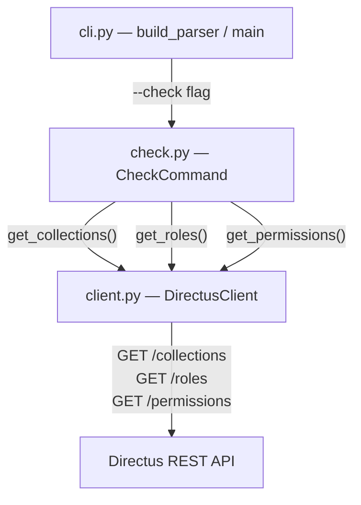

# Design Document: directus-check-command

## Overview

The `--check` command adds a read-only inspection mode to the `directus-ac` CLI. When invoked, it connects to a Directus instance using the existing `DirectusClient` and retrieves collections, roles, and permissions — then prints a structured summary to stdout without modifying any data.

This feature reuses the existing HTTP client infrastructure (`DirectusClient`) and exception hierarchy. The main addition is a new `CheckCommand` class that orchestrates the read operations and formats the output, plus CLI wiring to route `--check` invocations to this new code path.

### Design Decisions

1. **Separate module** — The check logic lives in a new `directus_ac/check.py` module rather than being inlined in `cli.py`. This keeps the CLI module focused on argument parsing and dispatch.
2. **No config file required** — Unlike the `apply` path, `--check` does not require a YAML config file. It operates purely against the live Directus state.
3. **Reuse existing client** — All HTTP communication goes through `DirectusClient`, which already handles auth headers, error translation, and connection failures.
4. **Plain text output** — Output is human-readable plain text with section headers. No JSON or table formatting is needed for the initial implementation.

## Architecture



**Flow:**

1. `cli.py` parses arguments. If `--check` is present, it resolves credentials (URL + token) and instantiates `DirectusClient`.
2. `cli.py` creates a `CheckCommand(client)` and calls `check.run()`.
3. `CheckCommand.run()` fetches collections, roles, and permissions via the client, formats the output, and prints to stdout.
4. On success, `main()` exits with code 0. On any `DirectusACError`, it prints the error to stderr and exits with code 1.

## Components and Interfaces

### 1. CLI Layer (`cli.py`)

**Changes to `build_parser()`:**

Add a `--check` flag:

```python
parser.add_argument(
    "--check",
    action="store_true",
    default=False,
    help="Read-only: display current collections, roles, and permissions",
)
```

**Changes to `main()`:**

Early branch after credential resolution:

```python
if args.check:
    client = DirectusClient(base_url=url, token=token)
    check_cmd = CheckCommand(client=client)
    check_cmd.run()
    sys.exit(0)
```

The `--check` path skips config loading, validation, and permission application entirely. It only requires `--url`/`DIRECTUS_URL` and `--token`/`DIRECTUS_TOKEN`.

When `--check` is provided, the `--config` argument is not required and is ignored.

### 2. Check Module (`check.py`)

```python
class CheckCommand:
    """Read-only inspection of a Directus instance's access control state."""

    def __init__(self, client: DirectusClient) -> None:
        self._client = client

    def run(self) -> None:
        """Fetch and print collections, roles, and permissions."""
        ...

    def _format_collections(self, collections: list[DirectusCollection]) -> str:
        """Format the collections section."""
        ...

    def _format_roles(self, roles: list[DirectusRole]) -> str:
        """Format the roles section."""
        ...

    def _format_permissions(
        self,
        permissions: list[DirectusPermission],
        roles: list[DirectusRole],
    ) -> str:
        """Format the permissions section, grouped by role."""
        ...
```

**Key behaviors:**

- `run()` calls `get_collections()`, `get_roles()`, `get_permissions()` on the client.
- If any list is empty, it prints a "No X found" message for that section.
- Permissions are grouped by role. Role UUIDs are resolved to names using the roles list. Unresolvable UUIDs are displayed as-is.
- All output goes to stdout via `print()`.
- Exceptions propagate to `main()` for uniform error handling.

### 3. Client Layer (`client.py`)

No changes needed. The existing `get_collections()`, `get_roles()`, and `get_permissions()` methods already provide the required read operations.

### 4. Exception Handling

No new exception classes needed. The existing hierarchy covers all error cases:

| Scenario | Exception | Exit Code |
|----------|-----------|-----------|
| Connection refused / DNS / timeout | `ConnectionError` | 1 |
| HTTP 401 / 403 | `AuthError` | 1 |
| Other non-2xx | `APIError` | 1 |
| Missing URL or token | Direct `sys.exit(1)` | 1 |

## Data Models

No new Pydantic models are required. The check command uses the existing models:

- `DirectusCollection` — has `collection: str` field (the collection name)
- `DirectusRole` — has `id: str` and `name: str` fields
- `DirectusPermission` — has `id: int`, `role: str`, `collection: str`, `action: str` fields

### Internal Data Structures

The `_format_permissions` method builds an intermediate grouping structure:

```python
# role_id -> { collection -> [action, ...] }
grouped: dict[str, dict[str, list[str]]]
```

And a lookup map for role name resolution:

```python
# role_id -> role_name
role_map: dict[str, str] = {role.id: role.name for role in roles}
```

## Correctness Properties

*A property is a characteristic or behavior that should hold true across all valid executions of a system — essentially, a formal statement about what the system should do. Properties serve as the bridge between human-readable specifications and machine-verifiable correctness guarantees.*

### Property 1: Collections section formatting

*For any* non-empty list of collection names, the formatted collections output SHALL start with a line containing exactly "Collections" followed by each collection name on its own separate line, with no collection names missing or duplicated.

**Validates: Requirements 2.2, 7.1**

### Property 2: Roles section formatting

*For any* non-empty list of roles (each having a name and an id), the formatted roles output SHALL start with a line containing exactly "Roles" followed by one line per role, where each line contains the role name and its identifier separated by a space.

**Validates: Requirements 3.2, 7.2**

### Property 3: Permission grouping structure

*For any* non-empty list of permission entries and a corresponding roles list, the formatted permissions output SHALL start with a line containing exactly "Permissions", followed by role sections where each role name appears on its own unindented line and each collection-actions entry appears indented beneath its role, with one entry per line.

**Validates: Requirements 4.2, 7.3, 7.4**

### Property 4: Role UUID resolution in permissions display

*For any* set of permission entries and a roles list, if a permission's role UUID exists in the roles list then the output SHALL display the human-readable role name; if the UUID does not exist in the roles list then the output SHALL display the UUID itself as the identifier.

**Validates: Requirements 4.4, 4.5**

### Property 5: Output order preservation

*For any* ordered list of collections, roles, or permissions returned by the API, the formatted output SHALL preserve the original ordering of items within each section.

**Validates: Requirements 7.6**

## Error Handling

The `--check` command reuses the existing exception hierarchy. Error handling follows the same pattern as the apply command:

| Error Condition | Exception Type | User-Facing Message | Exit Code |
|----------------|---------------|---------------------|-----------|
| Connection refused / DNS / timeout | `ConnectionError` | "Cannot reach Directus at {url}: {detail}" | 1 |
| HTTP 401 or 403 | `AuthError` | "Authentication failed. Verify your token." | 1 |
| Other non-2xx HTTP | `APIError` | "HTTP {status} — {detail}" | 1 |
| Missing `--url` and no `DIRECTUS_URL` | N/A (direct exit) | "Error: Directus URL must be provided via --url or DIRECTUS_URL" | 1 |
| Missing `--token` and no `DIRECTUS_TOKEN` | N/A (direct exit) | "Error: Auth token must be provided via --token or DIRECTUS_TOKEN" | 1 |

**Error flow in `main()`:**

```python
try:
    check_cmd.run()
    sys.exit(0)
except DirectusACError as exc:
    logger.error("%s", exc)
    sys.exit(1)
```

All errors from the client propagate up through `CheckCommand.run()` without being caught — the top-level handler in `main()` catches `DirectusACError` and writes the message to stderr.

### Empty-state handling

When a section has no data, the formatter prints a descriptive message instead of an empty list:

- No collections: `"  No collections found"`
- No roles: `"  No roles found"`
- No permissions: `"  No permissions found"`

These are informational — the command still exits with code 0.

## Testing Strategy

### Unit Tests (example-based)

Unit tests cover specific scenarios and integration points:

1. **CLI argument parsing** — `--check` flag is accepted, works with `--url`/`--token`, does not require `--config`
2. **Credential resolution** — `--url` overrides `DIRECTUS_URL`, `--token` overrides `DIRECTUS_TOKEN`, missing credentials produce error
3. **Read-only verification** — mock transport asserts only GET requests are issued
4. **Error scenarios** — connection failure, auth error, API error all produce correct exit code and stderr output
5. **Empty state** — empty collections/roles/permissions produce appropriate messages
6. **Exit codes** — success exits 0, all failures exit 1

### Property Tests (property-based)

Property-based tests verify the formatting logic using Hypothesis to generate random inputs:

- **Library**: Hypothesis (already in `requirements-dev.txt`)
- **Minimum iterations**: 100 per property
- **Tag format**: `Feature: directus-check-command, Property {N}: {title}`

Each correctness property maps to a single property-based test targeting the pure formatting functions (`_format_collections`, `_format_roles`, `_format_permissions`). These functions are deterministic transformations from structured data to strings, making them ideal PBT targets.

**Test file**: `tests/test_check.py`

| Property | Test Target | Generator Strategy |
|----------|-------------|-------------------|
| Property 1 | `_format_collections()` | Lists of 1–50 non-empty strings (collection names) |
| Property 2 | `_format_roles()` | Lists of 1–20 `DirectusRole` instances with random names/UUIDs |
| Property 3 | `_format_permissions()` | Lists of 1–50 `DirectusPermission` + 1–10 `DirectusRole` |
| Property 4 | `_format_permissions()` | Permissions with mix of resolvable and unresolvable role UUIDs |
| Property 5 | All format functions | Ordered lists, verify output order matches input order |

