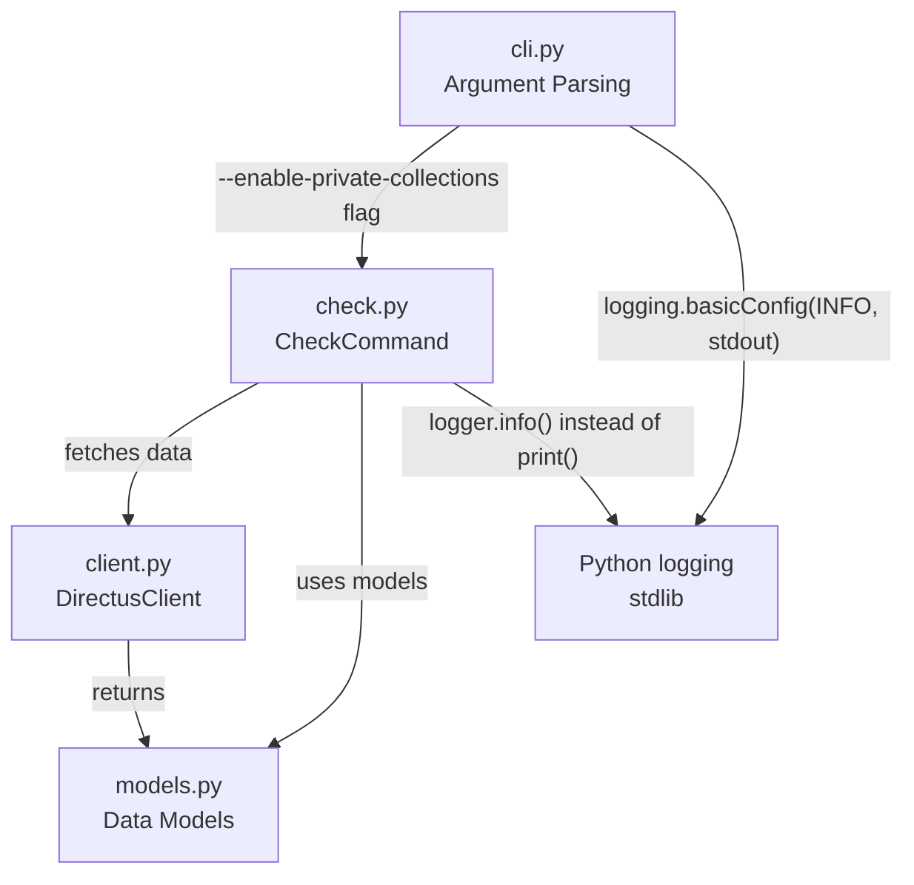
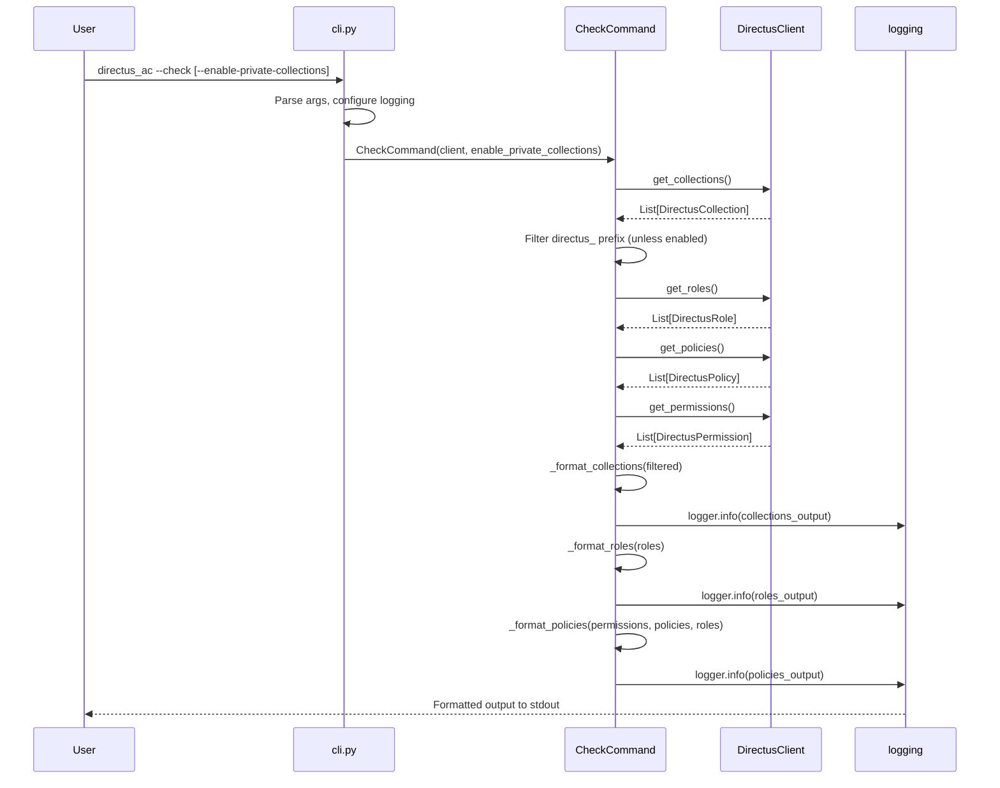
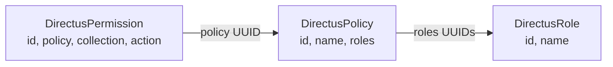

# Design Document: Refactor Improvements

## Overview

This feature introduces four targeted improvements to the `directus_ac` CLI tool's `check` command output and internal code quality:

1. **Rename "Permissions" section to "Policies"** — Aligns the output header with Directus v11+ naming conventions where permissions are organized under policies.
2. **Replace print() with logging module** — Converts all `print()` calls in `check.py` to use Python's `logging` module, leveraging the existing `logging.basicConfig` configuration in `cli.py`.
3. **Human-readable policy identifiers** — Where the output currently shows numeric IDs or raw UUIDs for policies, display the policy name or a `collection+action` description instead.
4. **Add `--enable-private-collections` CLI flag** — Introduces a flag to include `directus_`-prefixed system collections in the check output. By default, these collections are omitted (matching the existing `--include-system` behavior in `generate`).

These changes are backward-compatible in terms of CLI interface (new flag is opt-in) but will change the textual output format of the `check` command.

## Architecture

The changes touch three layers of the application: CLI argument parsing, command execution/formatting, and output rendering.



### Data Flow for Check Command



## Components and Interfaces

### Component 1: CLI Argument Parser (`cli.py`)

**Purpose**: Adds the `--enable-private-collections` flag and passes it to `CheckCommand`.

**Interface Changes**:
```python
# New argument in build_parser()
parser.add_argument(
    "--enable-private-collections",
    action="store_true",
    default=False,
    help="Include directus_ system collections in --check output",
)
```

**Responsibilities**:
- Register the new `--enable-private-collections` argument
- Pass the flag value to `CheckCommand` constructor
- Existing `logging.basicConfig` already handles INFO-level to stdout (no change needed)

### Component 2: CheckCommand (`check.py`)

**Purpose**: Formats and outputs the access control state of a Directus instance.

**Interface Changes**:
```python
class CheckCommand:
    def __init__(self, client: DirectusClient, enable_private_collections: bool = False) -> None:
        self._client = client
        self._enable_private_collections = enable_private_collections

    def run(self) -> None:
        """Fetch and log collections, roles, and policies."""
        ...

    def _format_collections(self, collections: list[DirectusCollection]) -> str:
        """Format collections, filtering directus_ prefix unless enabled."""
        ...

    def _format_roles(self, roles: list[DirectusRole]) -> str:
        """Format roles section (unchanged logic)."""
        ...

    def _format_policies(
        self,
        permissions: list[DirectusPermission],
        policies: list[DirectusPolicy],
        roles: list[DirectusRole],
    ) -> str:
        """Format the policies section (renamed from _format_permissions).
        
        Uses policy name as human-readable identifier instead of numeric ID.
        Groups permissions by role, showing policy name in sub-headers.
        """
        ...
```

**Responsibilities**:
- Filter `directus_`-prefixed collections unless `enable_private_collections=True`
- Use `logger.info()` instead of `print()` for all output
- Rename section header from "Permissions" to "Policies"
- Resolve policy UUIDs to human-readable policy names using the `DirectusPolicy.name` field
- Rename internal method from `_format_permissions` to `_format_policies`

### Component 3: DirectusClient (`client.py`)

**Purpose**: HTTP client for Directus REST API.

**Interface**: No changes required. The client already fetches policy names via `get_policies()` which returns `DirectusPolicy` objects with `id`, `name`, and `roles` fields.

### Component 4: Data Models (`models.py`)

**Purpose**: Pydantic models for API responses.

**Interface**: No changes required. `DirectusPolicy` already has a `name` field that provides the human-readable identifier.

## Data Models

### Existing Models (No Changes)

```python
class DirectusPolicy(BaseModel):
    id: str       # UUID
    name: str     # Human-readable name (e.g., "Editor Policy")
    roles: list[str]  # Role UUIDs linked to this policy

class DirectusPermission(BaseModel):
    id: int       # Numeric ID (will no longer be displayed)
    policy: str   # Policy UUID
    collection: str
    action: str   # "read", "create", "update", "delete"

class DirectusCollection(BaseModel):
    collection: str  # Collection name (may start with "directus_")
```

### Data Resolution Chain



**Key resolution logic**:
- Permission → Policy: resolved via `permission.policy` → `policy.id` (display `policy.name`)
- Policy → Role: resolved via `policy.roles` → `role.id` (display `role.name`)
- If policy name cannot be resolved: fall back to displaying the policy UUID
- If role name cannot be resolved: fall back to displaying the role UUID

## Error Handling

### Error Scenario 1: Unresolvable Policy ID

**Condition**: A permission references a `policy` UUID that doesn't exist in the fetched policies list.
**Response**: Group those permissions under the raw policy UUID as the section identifier (existing behavior, maintained).
**Recovery**: No recovery needed; informational output still displays.

### Error Scenario 2: Unresolvable Role ID

**Condition**: A policy's `roles` list contains a UUID not found in the fetched roles list.
**Response**: Display the raw UUID instead of a role name (existing behavior, maintained).
**Recovery**: No recovery needed.

### Error Scenario 3: All Collections Filtered

**Condition**: With `--enable-private-collections` disabled (default), all collections start with `directus_`.
**Response**: Display "No collections found" in the Collections section.
**Recovery**: User can re-run with `--enable-private-collections` to see system collections.

## Testing Strategy

### Unit Testing Approach

- Update existing tests in `test_check.py` to reflect the renamed section header ("Policies" instead of "Permissions")
- Add tests for the `enable_private_collections` filtering logic
- Test that `_format_policies` uses policy names instead of numeric IDs
- Verify `CheckCommand.__init__` accepts the new `enable_private_collections` parameter

### Property-Based Testing Approach

**Property Test Library**: Hypothesis (already in use)

- **Collection filtering property**: For any list of collections, when `enable_private_collections=False`, the output contains no collection names starting with `directus_`. When `True`, all collections appear.
- **Policy name resolution property**: For any set of permissions with associated policies, the output section header is "Policies" and each policy is identified by its `name` field (not numeric `id`).
- **Logging output property**: All output goes through the logging module; no direct `print()` calls remain in `check.py`.

### Integration Testing Approach

- Verify end-to-end that `directus_ac --check` produces output with "Policies" header
- Verify `directus_ac --check --enable-private-collections` includes `directus_` collections
- Verify logging output format matches expected structure

## Performance Considerations

No performance impact. The changes are purely cosmetic (output formatting) and add a simple string prefix filter (`startswith("directus_")`) which is O(n) on the collections list — negligible given typical Directus instance sizes.

## Security Considerations

No security impact. The `--enable-private-collections` flag only controls display filtering of already-fetched data. It does not grant additional API access or expose sensitive information beyond what the authenticated token already permits.

## Dependencies

No new dependencies. All changes use Python standard library (`logging`) and existing project dependencies (`pydantic`, `httpx`).

## Output Format Changes

### Before (Current)

```
Collections
  articles
  users
  directus_users
  directus_roles
Roles
  Admin uuid-admin-123
  Editor uuid-editor-456
Permissions
  Admin
    articles: read, create
  Editor
    users: read
```

### After (Default — no flag)

```
Collections
  articles
  users
Roles
  Admin uuid-admin-123
  Editor uuid-editor-456
Policies
  Admin
    articles: read, create
  Editor
    users: read
```

### After (With `--enable-private-collections`)

```
Collections
  articles
  users
  directus_users
  directus_roles
Roles
  Admin uuid-admin-123
  Editor uuid-editor-456
Policies
  Admin
    articles: read, create
    directus_users: read
  Editor
    users: read
```

## Correctness Properties

*A property is a characteristic or behavior that should hold true across all valid executions of a system — essentially, a formal statement about what the system should do. Properties serve as the bridge between human-readable specifications and machine-verifiable correctness guarantees.*

### Property 1: Section header naming

*For any* set of permissions, policies, and roles passed to the check command formatter, the output section that groups permissions by role SHALL always use "Policies" as its header, never "Permissions".

**Validates: Requirements 1.1, 1.2**

### Property 2: Output via logging only

*For any* invocation of the Check_Command, all output SHALL be emitted through `logging.Logger.info()` calls, and the `check.py` module SHALL contain zero `print()` function calls.

**Validates: Requirements 2.1, 2.2**

### Property 3: Policy name resolution

*For any* set of permissions with associated policies that have known names, the Policies section output SHALL display the human-readable policy name (resolved via the policy's `name` field), never a numeric `id` field.

**Validates: Requirements 3.1, 3.3**

### Property 4: Unresolvable policy fallback

*For any* permission that references a policy UUID not present in the fetched policies list, the Check_Command SHALL display the raw UUID as the identifier in the Policies section.

**Validates: Requirements 3.2**

### Property 5: Private collection filtering (default)

*For any* list of collections, when `enable_private_collections=False`, no collection whose name starts with `directus_` SHALL appear in the Collections section output.

**Validates: Requirements 4.2**

### Property 6: Private collection inclusion (opt-in)

*For any* list of collections, when `enable_private_collections=True`, all collections (including those with `directus_` prefix) SHALL appear in the Collections section output.

**Validates: Requirements 4.3**

### Property 7: Roles with empty permissions after filtering

*For any* role that has permissions only on Private_Collections, when `enable_private_collections=False`, the role SHALL still appear in the Policies section (with no collection entries listed beneath it).

**Validates: Requirements 4.5**
